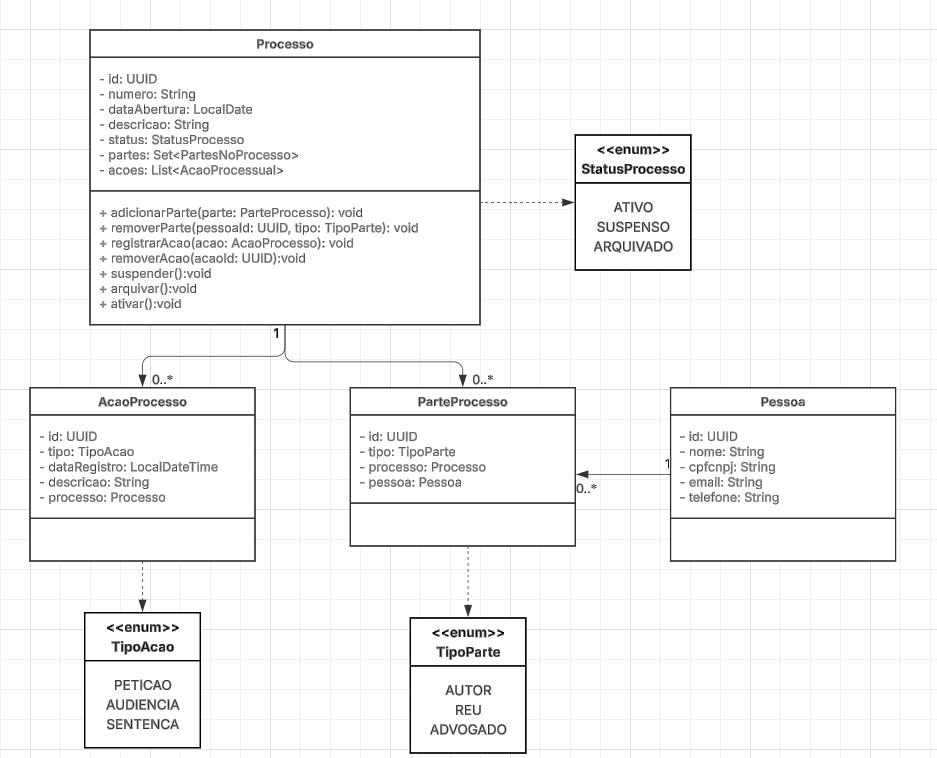

# Processo Jurídico

Projeto de API para gestão de processos, partes e ações.

## Links

- Aplicação: https://processo-juridico.onrender.com
- Documentação (Swagger): https://processo-juridico.onrender.com/docs
- Diagrama de classes: [Diagrama de classes (Lucidchart)](https://lucid.app/lucidchart/a5f68b3d-c4e4-4725-82e3-dba987131213/edit?viewport_loc=45%2C116%2C2217%2C1031%2CHWEp-vi-RSFO&invitationId=inv_237109bc-575e-4be0-aa69-8f2f657058bc)

## Diagrama de classes

